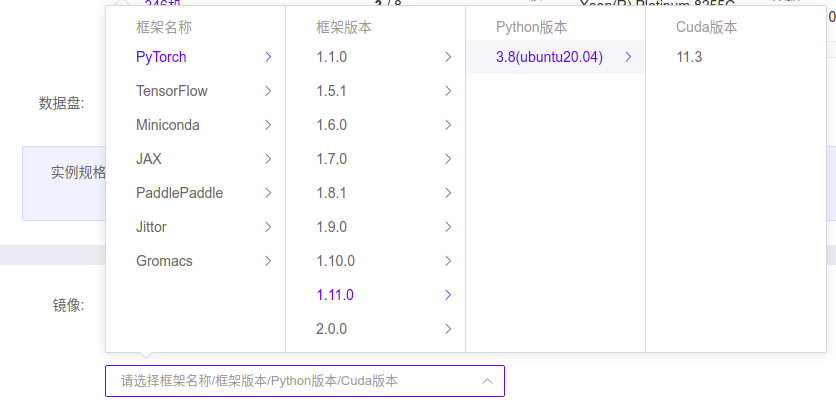
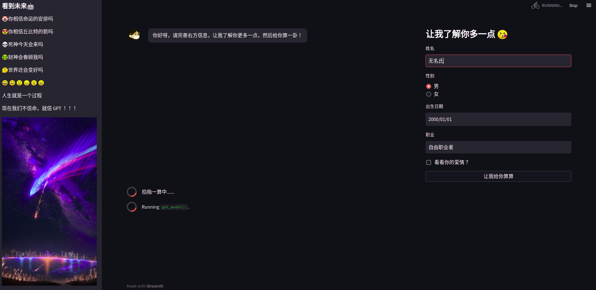

# fortune-teller
「Open Source」算命大师(fortune-teller)  
「100行代码快速搭建一个大模型算命服务」

## 代码
本仓库只有fortune_teller.py一个代码文件，详细说明见代码中的注释。

## 部署
### 本地部署
* 安装依赖库  
```bash
cd fortune-teller
pip install -r requirements.txt -i https://pypi.tuna.tsinghua.edu.cn/simple
```
* 启动服务  
```bash
# CPU部署(不建议使用，因为非常慢！！！)
streamlit run fortune_teller_cpu.py --theme.base "dark" --server.port 6006
# GPU部署(本地需要8G显存)
streamlit run fortune_teller.py --theme.base "dark" --server.port 6006
```
### 云端部署
这里我选用的是性价比较高的[AutoDL](https://www.autodl.com/)，
对于需要低成本部署的可以参考[ChatGLM-6B的低成本部署](https://github.com/THUDM/ChatGLM-6B#%E4%BD%8E%E6%88%90%E6%9C%AC%E9%83%A8%E7%BD%B2)
* 机器申请  
我的镜像环境如下：  

* 环境配置  
使用 AutoDL 部署的开机后进入 JupyterLab 即可在终端上操作机器  
将代码clone到自己的工作目录下  
```bash
# HTTP方式
git clone https://github.com/wan-h/fortune-teller.git
# SSH方式
git clone git@github.com:wan-h/fortune-teller.git
```
* 安装依赖库  
```bash
cd fortune-teller
pip install -r requirements.txt -i https://pypi.tuna.tsinghua.edu.cn/simple
```
* 启动服务  
```bash
# 这里使用6006端口，因为 AutoDL默认暴露该端口，本地部署可以自由指定
streamlit run fortune_teller.py --theme.base "dark" --server.port 6006
```
* 页面访问
使用 AutoDL 的部署的启动服务后，控制台页面点击自定义服务获取暴露出来的访问地址。  
  
第一次使用的时候需要下载模型，所以需要耐心等待一下，在启动终端可以看到进度情况。  
部署成功后的页面这样子：  
  
然后就可以愉快的玩耍了，也可以自己做一些修改，做一些有意思的APP出来。

## 协议
本仓库的代码依照 [Apache-2.0](LICENSE) 协议开源，ChatGLM-6B 模型的权重的使用则需要遵循 [Model License](MODEL_LICENSE)。

## 兴趣小组
添加好友，申请进群  


## Thanks
Thanks for [THUDM/ChatGLM-6B](https://github.com/THUDM/ChatGLM-6B)